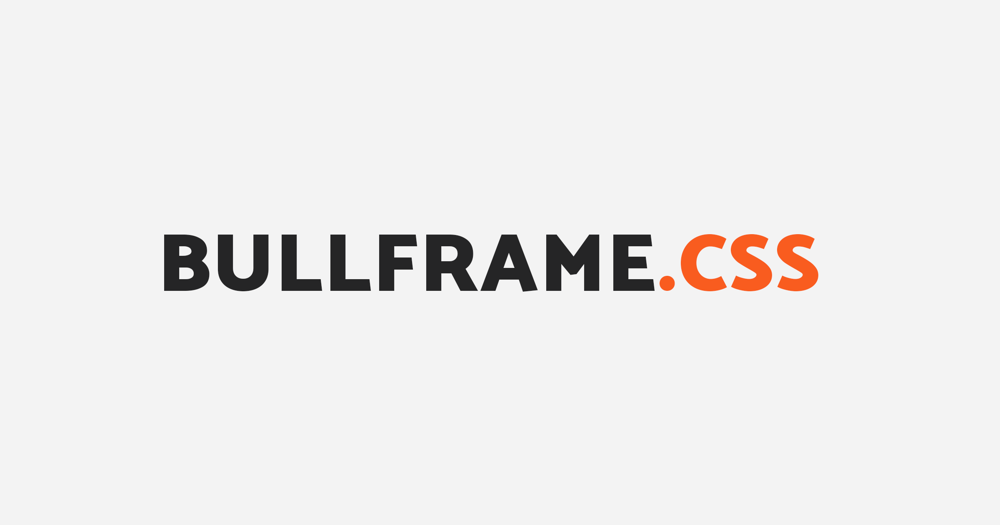

# bullframe.css



[https://github.com/marcop135/bullframe.css](https://github.com/marcop135/bullframe.css)

bullframe.css is a (S)CSS framework that works on every browsers, modern or not.

It's a cross-browser, responsive, IE8+ collection of default HTML UI elements ([atoms](https://atomicdesign.bradfrost.com/chapter-2/#atoms)) for your Sass project.

1. Add a good HTML template
2. Write semantic HTML5
3. Add a few utility classes (optional)
4. Add common JS polyfills for good old browsers support (optional)
5. Drop the custom styles you need
6. _...ready to go everywhere!_

**Jump to:**

Getting started:

- [Download](#download)
- [CDN](#CDN)
- [npm](#npm)
- [HTML template IE8+](#ie8-and-old-browsers)
- [HTML template IE11+](#ie11-and-modern-browsers)

Customization:

- [No classes (Classless)](#no-classes-classless)
- [Utilities only](#just-utilities)
- [Dark mode](#dark-mode)

More:

- [Test page](https://marcop135.github.io/bullframe.css/)
- [Browser support](#browser-compatibility)
- [Changelog](#changelog)
- _[Sponsor me!](#become-a-sponsor)_

---

## Best features

- IE8+ support and a wide range of desktop and mobile browsers
- Add responsive-ness and normalize as much as possible HTML elements *out-of-the-box*
- Progressive responsive web design focused
- Responsive, cross-browser, HTML5 form elements by default
- A simple 12-columns fluid grid system with IE8+ support
- Sass architecture
- CSS BEM
- Responsive typography
- Dark mode
- Get utility classes (e.g. `<h2 class="bf-h1">`) or not (no-class / classless framework)
- Isolated utility classes to avoid conflicts between frameworks' classes
- `bullframe-classless.min.css` is just 10KB~ 🎉

## Internet Explorer usage and support

Do people still use Internet Explorer?

Short answer: **yes!** enterprise-level companies, legacy business applications, accessibility-focused projects and some non-tech-savvy older people.
[Long answer](https://www.quora.com/Do-people-still-use-Internet-Explorer-in-2020)

[Browser worldwide usage comparison](https://gs.statcounter.com/browser-market-share/desktop/worldwide#monthly-201904-202004-bar)

Read this [Lea Verou’s Twitter thread](https://twitter.com/LeaVerou/status/1246252696602128384) to get more developers' points of view.

! Bootstrap v5 [will drop IE10 and IE11 support](https://github.com/twbs/bootstrap/pull/30377). Read the [Hacker News thread](https://news.ycombinator.com/item?id=22802003).

---

## What's included

You'll see something like this:

```text
bullframe.css/
└── dist/
    └── sourcemaps/
    │   ├── ...
    ├── css/
    │   ├── bullframe-classless.css
    │   ├── bullframe-classless.min.css
    │   ├── bullframe-dark-prefers.css
    │   ├── bullframe-dark-prefers.min.css
    │   ├── bullframe-dark.css
    │   ├── bullframe-dark.min.css
    │   ├── bullframe-utilities.css
    │   ├── bullframe-utilities.min.css
    │   ├── bullframe.css
    │   ├── bullframe.min.css
└── src/scss/
    └── forms/
    │   ├── ...
    └── mixins/
    │   ├── ...
    └── typography/
    │   ├── ...
    └── utilities/
    │   ├── ...
    └── variables/
    │   ├── ...
    ...
    ├── bullframe-classless.scss
    ├── bullframe-dark-prefers.scss
    ├── bullframe-dark.scss
    ├── bullframe-utilities.scss
    ├── bullframe.scss
└── gulpfile.js
└── index.html
...
```

## Getting started

### Download

[Download the latest release](https://github.com/marcop135/bullframe.css/archive/master.zip)

### CDN

```html
<link rel="stylesheet" href="https://cdn.jsdelivr.net/gh/marcop135/bullframe.css/dist/css/bullframe.min.css">
```

### npm

Once you have installed [Node.js], you can run this command to install bullframe.css into your project:

`npm install bullframe.css`

[What is npm?](https://www.npmjs.com/get-npm)

### HTML

Add some HTML markup, and two JS polyfills (if you need a wide cross-browser support).

Tip: if you need min/max-width CSS3 Media Queries support in IE8 (e.g. mobile-first responsive design), you could polyfill it with [respond.js](https://github.com/scottjehl/Respond).

#### IE8+ and old browsers

```html
<!DOCTYPE html>
<html>
<head>
<meta charset="utf-8">
<meta http-equiv="X-UA-Compatible" content="IE=edge">
<meta name="viewport" content="width=device-width, initial-scale=1, shrink-to-fit=no">

<link rel="stylesheet" href="https://cdn.jsdelivr.net/gh/marcop135/bullframe.css/dist/css/bullframe.min.css">

<!-- enable HTML5 elements, and fix IE10 viewport on Windows 8 -->
<script src="https://cdn.jsdelivr.net/combine/npm/html5shiv@3.7.3,npm/ie10-viewport-bug-workaround.js@1.0.0"></script>
</head>
<body>
  <div class="bf-container">
    <h1>Hello World!</h1>
  </div>

</body>
</html>
```

#### IE11+ and modern browsers

```html
<!DOCTYPE html>
<html>
<head>
<meta charset="utf-8">
<meta name="viewport" content="width=device-width, initial-scale=1, shrink-to-fit=no">

<link rel="stylesheet" href="https://cdn.jsdelivr.net/gh/marcop135/bullframe.css/dist/css/bullframe.min.css">

</head>
<body>
  <div class="bf-container">
    <h1>Hello World!</h1>
  </div>

</body>
</html>
```

#### IE8+ and old browsers (recommended)

Improve the JS polyfills security via the `integrity` and `crossorigin` attributes. [Read more](https://stackoverflow.com/questions/32039568/what-are-the-integrity-and-crossorigin-attributes)

```html
<!DOCTYPE html>
<html lang="en">
<head>
<meta charset="utf-8">
<meta http-equiv="X-UA-Compatible" content="IE=edge">
<meta name="viewport" content="width=device-width, initial-scale=1, shrink-to-fit=no">

<link
  type="text/css"
  rel="stylesheet"
  href="https://cdn.jsdelivr.net/gh/marcop135/bullframe.css/dist/css/bullframe.min.css"
  integrity="sha384-xL9PVrDQt5lFLFaPOMR1xJKpBz83hP1cjuND8oIMxl3kIM6yFyp7xzRChkB5ugUN"
  crossorigin="anonymous"
>

<!-- enable HTML5 elements and fix IE10 viewport on Windows 8 -->
<script
  src="https://cdn.jsdelivr.net/combine/npm/html5shiv@3.7.3,npm/ie10-viewport-bug-workaround.js@1.0.0"
  integrity="sha384-qBVh9Nh9vwp+qqJMBTOrfjBPwz5RMDGc4lscK3+4F6dtIUo89TeUhS9wiDPhgpi5"
  crossorigin="anonymous"
></script>

<body>
  <div class="bf-container">
    <h1>Hello World!</h1>
  </div>

</body>
</html>
```

#### IE11+ and modern browsers (recommended)

Improve the JS polyfills security via the `integrity` and `crossorigin` attributes. [Read more](https://stackoverflow.com/questions/32039568/what-are-the-integrity-and-crossorigin-attributes)

```html
<!DOCTYPE html>
<html lang="en">
<head>
<meta charset="utf-8">
<meta name="viewport" content="width=device-width, initial-scale=1, shrink-to-fit=no">

<link
  rel="stylesheet"
  href="https://cdn.jsdelivr.net/gh/marcop135/bullframe.css/dist/css/bullframe.min.css"
  integrity="sha384-xL9PVrDQt5lFLFaPOMR1xJKpBz83hP1cjuND8oIMxl3kIM6yFyp7xzRChkB5ugUN"
  crossorigin="anonymous"
>

</head>
<body>
  <div class="bf-container">
    <h1>Hello World!</h1>
  </div>

</body>
</html>
```

---

## Customization

### No classes (classless)

No classes, no utilities. Feel free to add yours and create your custom components.

Just drop this CSS file in your webpage, and the job is done!
Write semantic HTML and get nice styles and cross-browser normalization.

```html
<link rel="stylesheet" href="https://cdn.jsdelivr.net/gh/marcop135/bullframe.css/dist/css/bullframe-classless.min.css">
```

### Just utilities

Get all the utility classes

```html
<link rel="stylesheet" href="https://cdn.jsdelivr.net/gh/marcop135/bullframe.css/dist/css/bullframe-utilities.min.css">
```

### Dark mode

This enables a dark (dark-mode) style by default in all browsers:

```html
<link rel="stylesheet" href="https://cdn.jsdelivr.net/gh/marcop135/bullframe.css/dist/css/bullframe-dark.min.css">
```

And this, enables a dark-mode only if the user prefers it, in browsers that support the `prefers-color-scheme` media query.
Read more [on MDN](https://developer.mozilla.org/en-US/docs/Web/CSS/@media/prefers-color-scheme).

```html
<link rel="stylesheet" href="https://cdn.jsdelivr.net/gh/marcop135/bullframe.css/dist/css/bullframe-dark-prefers.min.css">
```

---

## Browser compatibility

### Desktop browsers

- IE 8+
- Latest stable two: Firefox, Chrome, Edge, Safari, Opera

### Mobile browsers

- Latest stable: Firefox, Chrome, Edge, Opera
- Mobile Safari iOS 7+
- IE Mobile 11

### Proxy browsers

- Latest Stable: Opera Mobile’s Turbo mode
- Latest Stable: Opera Mini

You can take a look at the [.browserslistrc](https://github.com/marcop135/bullframe.css/blob/master/.browserslistrc) file for [Autoprefixer](https://github.com/postcss/autoprefixer)

### Tested on real browsers

This project is tested in a wide range of browsers using also [BrowserStack](http://browserstack.com/) live, thanks to the BrowserStack Open Source initiative.


---

## Become a sponsor

[Sponsor me](https://github.com/sponsors/marcop135) and support my front-end efforts and open source!

## Contributors

[@englishextra](https://github.com/englishextra) the project is still live thanks to you!

## Contributing

Please read the [contribution guidelines](https://github.com/marcop135/bullframe.css/blob/master/.github/CONTRIBUTING.md).

---

## Changelog

[Changelog](https://github.com/marcop135/bullframe.css/blob/master/CHANGELOG.md)

## Acknowledgements

bullframe.css incorporates some of the styles found on some amazing CSS boilerplates and frameworks across the web. _Thank you!_

- @necolas [/normalize.css](https://github.com/necolas/normalize.css) for the extensive old browsers bug fixing documentation
- @h5bp [/main.css](https://github.com/h5bp/main.css) for the excellent print styles base and the keyboard utilities
- @twbs [/bootstrap](https://github.com/twbs/bootstrap) for some neat typography tricks, responsive embeds, base24 SVG icons, button styles, grid system breakpoints and spacing utilities _(a lot!)_
- @kognise [/water.css](https://github.com/kognise/water.css) for the "classless" concept inspiration and some form tricks
- @csswizardry @inuitcss [/inuit.css](https://github.com/inuitcss/inuitcss) for some advanced Sass tips and tricks

## License

The MIT License (MIT) - [http://opensource.org/licenses/MIT](http://opensource.org/licenses/MIT "The MIT License")

---

## Todos

- Add more screenshots
- Add CodePens
- Add a complete documentation
