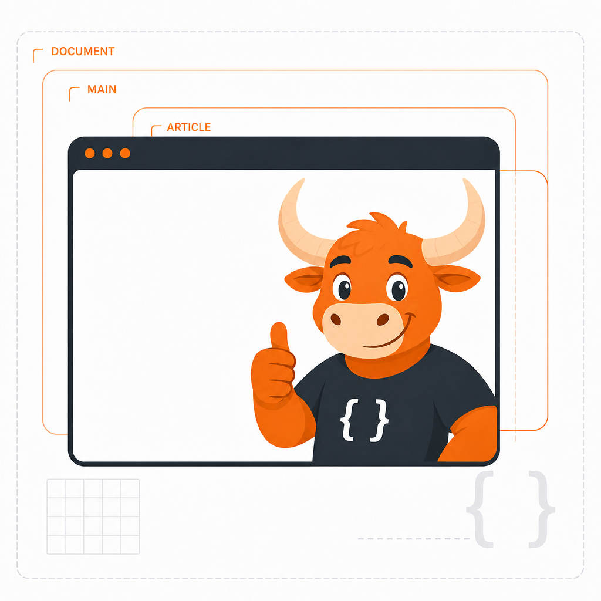

<p align="center">
  <picture>
    <source media="(prefers-color-scheme: dark)" srcset="src/docs/github-readme/bf-readme-hero-dark.png">
    <source media="(prefers-color-scheme: light)" srcset="src/docs/github-readme/bf-readme-hero-light.png">
    
  </picture>
</p>

<p align="center">
  One UI framework. Three ways to write it. Zero JavaScript.
</p>

<p align="center">
  <a href="https://www.npmjs.com/package/bullframe.css"></a>
  <a href="https://github.com/marcop135/bullframe.css/actions/workflows/ci.yml"></a>
  <a href="https://bullframecss.marcopontili.com/"></a>
  
  
  
  <a href="LICENSE"></a>
</p>

---

## Documentation

Full docs: [bullframecss.marcopontili.com](https://bullframecss.marcopontili.com/)

- [Getting started](https://bullframecss.marcopontili.com/getting-started)
- [Docs index](https://bullframecss.marcopontili.com/README)
- [Migration (v5 to v6)](https://bullframecss.marcopontili.com/migration)
- [Changelog](CHANGELOG.md)

## Getting started

```bash
npm install bullframe.css
```

```js
import 'bullframe.css';
```

```html
<link rel="stylesheet" href="https://cdn.jsdelivr.net/npm/bullframe.css@latest">
```

Eight builds (class-based, classless, utilities, dark, system-default, modern). Shared `--bf-*` tokens. Details in the [docs](https://bullframecss.marcopontili.com/getting-started).

## License

[MIT](LICENSE) · [Marco Pontili](https://marcopontili.com)
