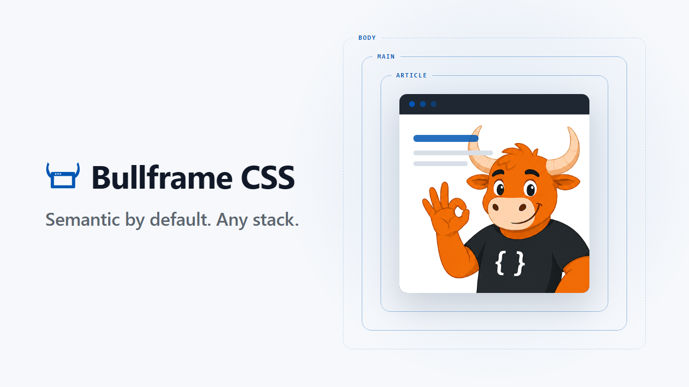

<p align="center">
  <picture>
    <source media="(prefers-color-scheme: dark)" srcset="src/docs/github-readme/bf-readme-hero-dark-16x9.png">
    <source media="(prefers-color-scheme: light)" srcset="src/docs/github-readme/bf-readme-hero-light-16x9.png">
    
  </picture>
</p>

<p align="center">
  <strong>Bullframe CSS</strong><br>
  Semantic by default. Any stack.
</p>

<p align="center">
  <a href="https://www.npmjs.com/package/bullframe.css"></a>
  <a href="https://codepen.io/collection/nxpjRe"></a>
  <a href="https://bullframecss.marcopontili.com/"></a>
  
  
  
  <a href="LICENSE"></a>
</p>

---

## Why use it

- **Semantic HTML first:** headings, forms, tables, and links are styled without a pile of classes
- **Classless when you want it:** swap in `bullframe-classless.css` and keep markup as plain HTML
- **Dark without a script:** always-dark builds, or system-default builds that follow `prefers-color-scheme`
- **Accessible defaults:** focus-visible rings, reduced-motion respect, WCAG AA contrast on links and primary buttons
- **Native CSS, any stack:** PostCSS builds, no Sass, no runtime JavaScript, solid cross-browser support

## When to use

Pages and forms, not complex app UIs: docs, blogs, landings, help centers, listings, micro-sites. One stylesheet for reset, type, forms, and layout. Class-based or classless. No Tailwind-style utility pipeline.

## Getting started

```bash
npm install bullframe.css
```

```js
import 'bullframe.css';
```

```html
<link rel="stylesheet" href="https://cdn.jsdelivr.net/npm/bullframe.css">
```

## Docs

[bullframecss.marcopontili.com](https://bullframecss.marcopontili.com/)

## Contributing

See [CONTRIBUTING.md](./.github/CONTRIBUTING.md). Bug reports and feature requests go through [issues](https://github.com/marcop135/bullframe.css/issues).

## Author

[Marco Pontili](https://marcopontili.com)

## License

[MIT](./LICENSE)
