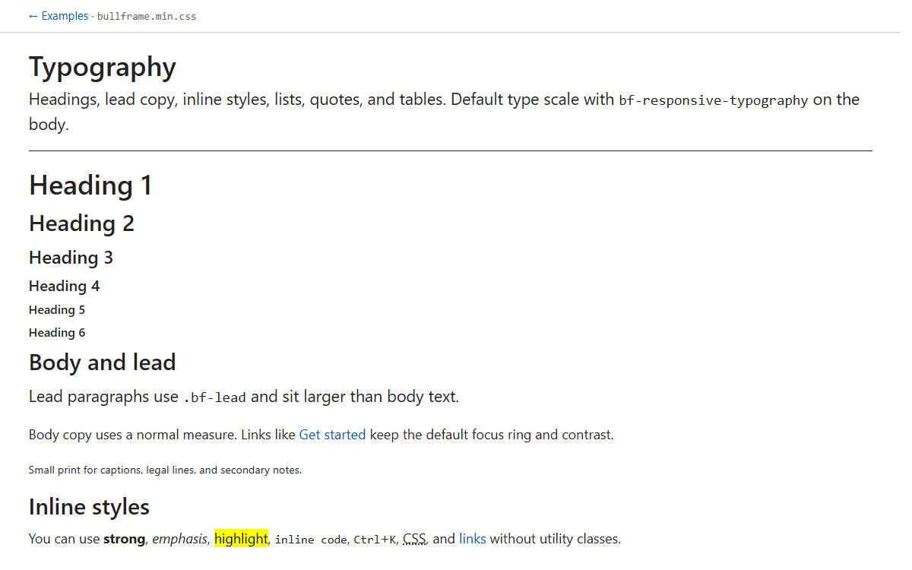
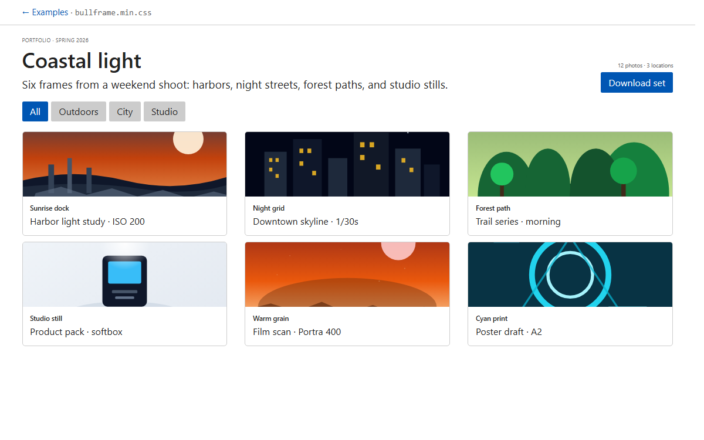
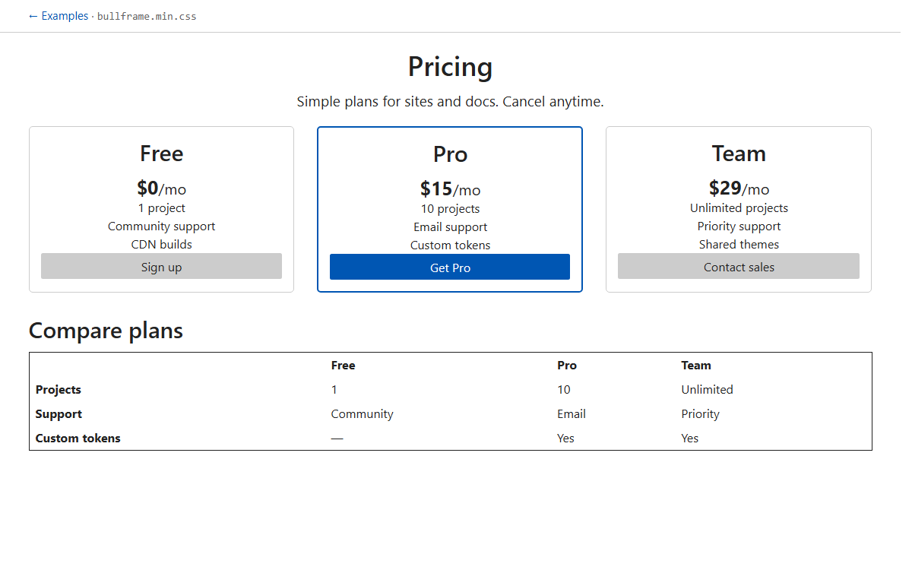
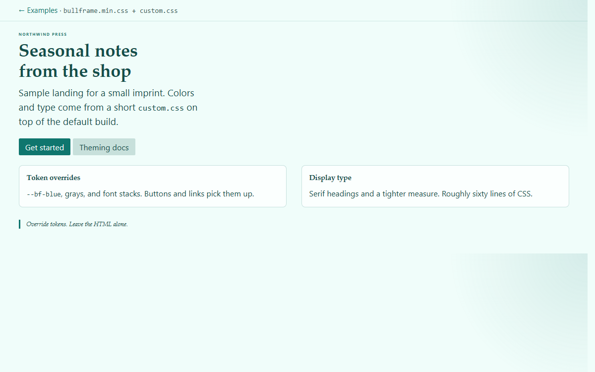
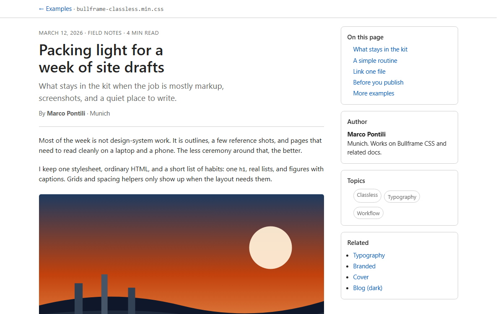
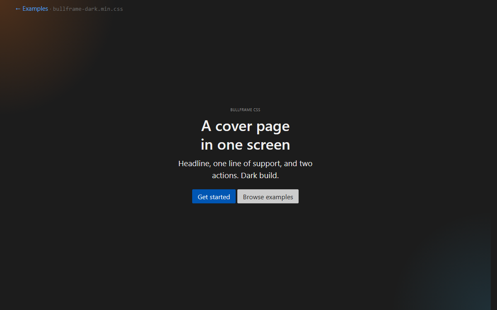

<div align="center">


# Bullframe CSS

Semantic by default. Any stack.

</div>

<p align="center">
  <a href="https://www.npmjs.com/package/bullframe.css"></a>
  <a href="https://github.com/marcop135/bullframe.css/actions/workflows/ci.yml"></a>
  <a href="LICENSE"></a>
</p>

---

One CSS file for plain HTML: type, forms, tables, buttons, and layout. No build step. No JavaScript.

Class-based or classless. Light, dark, or system. About 8 kB gzipped. Drop it on a landing, docs site, or help center.

## Quick start

1. Add the stylesheet (CDN, always the latest release):

<!-- sri:cdn:start -->
```html
<link rel="stylesheet" href="https://cdn.jsdelivr.net/npm/bullframe.css">
```
<!-- sri:cdn:end -->

2. Write semantic HTML. Headings, forms, tables, and buttons are styled without classes.

3. Swap the build when you need classless, dark, or system. See [Builds](#builds).

Or install from npm:

```bash
npm install bullframe.css
```

```js
import 'bullframe.css';
```

Default import: class-based, light. Other builds: `bullframe.css/classless`, `bullframe.css/dark`, and so on.

[Docs](https://bullframecss.marcopontili.com/) · [Examples](https://bullframecss.marcopontili.com/examples)

## Features

- Plain HTML looks finished before you write a class
- Classless when you want clean markup; classes when you need layout control
- Light and dark out of the box, no theme script
- One stylesheet, about 8 kB gzipped: type, forms, tables, buttons, layout
- Restyle the page by changing a few colour tokens
- Accessibility built in: clear focus, reduced motion, WCAG AA defaults
- Works with any stack: landings, docs, help centers
- npm or CDN; nothing to compile to use it
- AI skills for coding agents: `npx bullframe.css skills install`

## Examples

Ready to copy: landings, blogs, forms, docs. Plain HTML, one stylesheet.

<table>
  <tr>
    <td><a href="https://bullframecss.marcopontili.com/examples/typography/"></a></td>
    <td><a href="https://bullframecss.marcopontili.com/examples/album/"></a></td>
  </tr>
  <tr>
    <td><a href="https://bullframecss.marcopontili.com/examples/pricing/"></a></td>
    <td><a href="https://bullframecss.marcopontili.com/examples/branded/"></a></td>
  </tr>
  <tr>
    <td><a href="https://bullframecss.marcopontili.com/examples/blog/"></a></td>
    <td><a href="https://bullframecss.marcopontili.com/examples/cover/"></a></td>
  </tr>
</table>

[Browse all examples →](https://bullframecss.marcopontili.com/examples)

## AI skills

Markdown skills for AI coding agents ship in the npm package. No server. No API key.

```bash
npx bullframe.css skills install
```

Writes skill files plus a managed `AGENTS.md` block, and the matching layout under `.claude`, `.cursor`, or `.agents` when those folders exist.

Details: [AI skills](https://bullframecss.marcopontili.com/ai-skills).

## Builds

<details>
<summary>See all 7 variants</summary>

Seven files in `dist/css/`, each with a minified twin and a source map. Pick one; do not combine them, except utilities on top of another build.

| Build                                    | npm subpath                      | Use when                             |
| ---------------------------------------- | -------------------------------- | ------------------------------------ |
| `bullframe.css`                          | `bullframe.css`                  | Class-based, light                   |
| `bullframe-dark.css`                     | `bullframe.css/dark`             | Class-based, always dark             |
| `bullframe-system-default.css`           | `bullframe.css/system`           | Class-based, `prefers-color-scheme`  |
| `bullframe-classless.css`                | `bullframe.css/classless`        | Classless, light                     |
| `bullframe-classless-dark.css`           | `bullframe.css/classless/dark`   | Classless, always dark               |
| `bullframe-classless-system-default.css` | `bullframe.css/classless/system` | Classless, `prefers-color-scheme`    |
| `bullframe-utilities.css`                | `bullframe.css/utilities`        | `.bf-*` helpers only, no base styles |

**Classless** styles HTML tags only (no `.bf-*` classes). **Class-based** adds `.bf-*` grid, spacing, and helpers on top.

</details>

## Documentation

| Topic | |
| ----- | --- |
| [Docs](https://bullframecss.marcopontili.com/) | Home |
| [Getting started](https://bullframecss.marcopontili.com/getting-started) | Install and pick a build |
| [Examples](https://bullframecss.marcopontili.com/examples) | Page templates |
| [Kitchen sink](https://bullframecss.marcopontili.com/kitchen-sink/) | Every element in one place |
| [Variables](https://bullframecss.marcopontili.com/variables) | `--bf-*` tokens |
| [Components](https://bullframecss.marcopontili.com/components/) | Cards, modals, navigation, buttons |
| [Theming](https://bullframecss.marcopontili.com/theming) | Colours and dark mode |
| [API reference](https://bullframecss.marcopontili.com/api-reference) | Full token and class list |
| [AI skills](https://bullframecss.marcopontili.com/ai-skills) | Skills for AI coding agents |
| [Changelog](./CHANGELOG.md) | Release notes |

## Contributing

See [CONTRIBUTING.md](./.github/CONTRIBUTING.md).

Bugs → [issues](https://github.com/marcop135/bullframe.css/issues).

## License

[MIT](./LICENSE)

## Author

[Marco Pontili](https://marcopontili.com)
